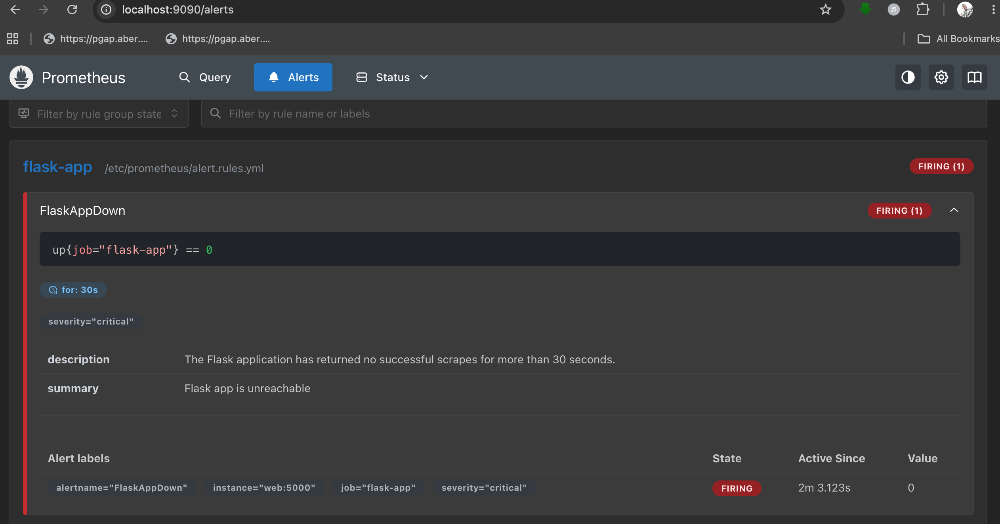

# Docker Production Assignment

This project builds on a containerised Flask web application to explore production-grade Docker practices. The goals of this assignment were to:

- Reduce image size significantly using multi-stage builds
- Set up a CI/CD pipeline with GitHub Actions so every push to `main` automatically builds and pushes the image to GHCR
- Scan the image for security vulnerabilities using Trivy and fix any findings
- Replace hardcoded credentials with proper environment variable management using `.env` files
- Add Prometheus and Grafana monitoring to the running stack


## GHCR Image

The production image is built and pushed automatically by the GitHub Actions pipeline on every push to `main`:

```
ghcr.io/bright-1h/docker-production:latest
ghcr.io/bright-1h/docker-production:<git-sha>   # e.g. sha-a1b2c3d
```

Pull it directly:
```bash
docker pull ghcr.io/bright-1h/docker-production:latest
```


## Multi-Stage Build

One of the goals of this assignment was to reduce the final image size as much as possible. The original Dockerfile used a single `python:3.11-slim` base and installed everything into it — which works, but leaves behind pip, setuptools, and other build-time tools that the running app never needs.

The rewritten Dockerfile uses two stages:

- Stage 1 (`builder`) — uses `python:3.11-slim` to create a virtual environment and install all dependencies from `requirements.txt` into it.
- Stage 2 (`runtime`) — starts fresh from `python:3.11-alpine` (a much smaller base) and copies only the pre-built `/venv` and `app.py` across. Nothing from the builder stage leaks in.

### Size comparison

Here's the output of `docker images` after building both versions:

```
REPOSITORY   TAG    IMAGE ID       CREATED AT                      SIZE
flask-app    v1.0   f8a79b8ea2b0   2026-05-14 21:02:36 +0000 GMT   214MB
flask-app    v2.0   b8476dafaef9   2026-05-14 21:02:36 +0000 GMT   132MB
```

That's a reduction from 214MB down to 132MB — **38% smaller** — without touching a single line of application code.


## CI/CD — Automated Builds with GitHub Actions

Every push to `main` triggers a GitHub Actions workflow (`.github/workflows/docker-publish.yml`) that:

1. Checks out the repository
2. Sets up Docker Buildx
3. Logs in to GHCR using the built-in `GITHUB_TOKEN` (no manual secret needed)
4. Builds the image and pushes it with two tags: `latest` and a short git SHA (e.g. `sha-a1b2c3d`)
5. Uses GitHub Actions layer cache so unchanged layers are skipped on subsequent runs


## Security Scan Findings — Trivy

`flask-app:v2.1` was scanned with Trivy, filtering for HIGH and CRITICAL severity only:

```bash
trivy image --severity HIGH,CRITICAL flask-app:v2.1
```

### Base image iteration

Three base images were tested to minimise the vulnerability surface:

| Base image | OS CVEs | Python CVEs | Total HIGH | Total CRITICAL |
|------------|---------|-------------|------------|----------------|
| `python:3.11-slim-bookworm` (Debian 12) | 17 | 5 | 18 | 4 |
| `python:3.11-slim-trixie` (Debian 13) | 7 | 3 | 10 | 0 |
| `python:3.11-alpine` (Alpine 3.23.4) | **0** | 3* | — | — |

\* Stale system Python dist-info baked into the base image — resolved by the fix below.

`python:3.11-alpine` was chosen as the final base. Alpine ships without gnutls, systemd, sqlite, ncurses and other Debian libraries that were responsible for all the OS-level CVEs.

### Python package vulnerabilities (fixed)

Two HIGH CVEs were found in the system Python's dist-info (`wheel` and `jaraco.context` vendored inside `setuptools`). Both had fixes available.

| CVE | Severity | Package | Installed | Fixed |
|-----|----------|---------|-----------|-------|
| CVE-2026-24049 | HIGH | wheel | 0.45.1 | 0.46.2 |
| CVE-2026-23949 | HIGH | jaraco.context (via setuptools) | 5.3.0 | 6.1.0 |

### How they were fixed

Upgrade steps were added to the Dockerfile for both the venv (builder stage) and the system Python (runtime stage). A key issue was that `ENV PATH="/venv/bin:$PATH"` was set before the upgrade step, causing plain `pip` to resolve to the venv's pip instead of the system one. The fix was to call the system pip by its full path:

```dockerfile
# In builder — upgrade packages inside the venv
RUN /venv/bin/pip install --no-cache-dir --upgrade "wheel>=0.46.2" setuptools

# In runtime — use full path to target system Python, not the venv
RUN /usr/local/bin/pip install --no-cache-dir --upgrade "wheel>=0.46.2" setuptools
```

Upgrading `setuptools` pulls in a version that vendors `jaraco.context>=6.1.0`, resolving CVE-2026-23949. Pinning `wheel>=0.46.2` directly resolves CVE-2026-24049.

### Final result

After switching to `python:3.11-alpine` and applying the upgrades, Trivy reports **0 HIGH and 0 CRITICAL** vulnerabilities.


## Prometheus Alerting — Bonus

An alert rule fires when the Flask app has been unreachable for more than 30 seconds.

### Why two docker-compose files?

Prometheus's config format does not support inline alert rules inside `prometheus.yml`. The `rule_files` key only accepts file paths — there is no mechanism to embed rules directly in the main config. This is a hard constraint of Prometheus, not a design choice.

Two files are therefore required, both mounted into the same directory inside the container:

| File | Container path | Purpose |
|---|---|---|
| `prometheus.yml` | `/etc/prometheus/prometheus.yml` | Main Prometheus config; declares scrape targets and points to the rules file |
| `alert.rules.yml` | `/etc/prometheus/alert.rules.yml` | Defines the `FlaskAppDown` alert rule |

Both are mounted via `docker-compose.yml`:
```yaml
volumes:
  - ./prometheus.yml:/etc/prometheus/prometheus.yml
  - ./alert.rules.yml:/etc/prometheus/alert.rules.yml
```

### Rule

```yaml
groups:
  - name: flask-app
    rules:
      - alert: FlaskAppDown
        expr: up{job="flask-app"} == 0
        for: 30s
        labels:
          severity: critical
        annotations:
          summary: "Flask app is unreachable"
          description: "The Flask application has returned no successful scrapes for more than 30 seconds."
```

**How it works:**

- Prometheus tracks a built-in `up` metric for every scrape target. It is `1` when the target responds successfully and `0` when it does not.
- `expr: up{job="flask-app"} == 0` selects the Flask app's scrape target specifically.
- `for: 30s` means the condition must hold continuously for 30 seconds before the alert transitions from `pending` to `firing`. This prevents false positives from brief network blips.

### Screenshot




## Running the App

Make sure you have Docker, Docker Compose, and `make` installed. Copy `.env.example` to `.env` and fill in your values before starting.

### Using Make (recommended)

A `Makefile` is included to simplify common operations:

| Command | Description |
|---|---|
| `make run` | Start the full stack locally with Docker Compose |
| `make stop` | Stop the local stack |
| `make clean` | Stop stack and remove all volumes and images |
| `make build` | Build the image (`$IMAGE:$IMAGE_TAG` as set in `.env`) |
| `make push` | Push the image to GHCR |
| `make scan` | Scan the image with Trivy (HIGH/CRITICAL only) |
| `make logs` | Follow logs for all services |
| `make deploy` | Deploy to Docker Swarm (initialises swarm automatically if needed) |
| `make undeploy` | Remove the Swarm stack |

```bash
make run          # start everything locally
make deploy       # deploy to Docker Swarm
make stop         # stop local stack
make undeploy     # remove Swarm stack
```

Override `IMAGE_TAG` on any target:
```bash
make build IMAGE_TAG=v1.0
make push  IMAGE_TAG=v1.0
make scan  IMAGE_TAG=v1.0
```

### Without Make

**Local development:**
```bash
docker compose up --build -d
```

**Docker Swarm:**
```bash
docker swarm init
docker stack deploy -c docker-compose.yml -c docker-compose.swarm.yml myapp
docker service ls
```

The app will be available at http://localhost:5000.

- `GET /` — Returns a greeting, the container hostname, and the current Redis visit count
- `GET /health` — Returns `{"status": "ok"}`, used by Docker to determine if the container is healthy

## Compose File Structure

Two compose files are used instead of one to keep local development and Swarm deployment cleanly separated.

| File | Purpose |
|---|---|
| `docker-compose.yml` | Base configuration used for everything. Uses a `bridge` network so `docker compose up` works on any machine without Docker Swarm initialised. |
| `docker-compose.swarm.yml` | Swarm-only overrides. Contains only the network driver change from `bridge` to `overlay`, which is required by Docker Swarm. |

At deploy time, Docker merges the two files in order:
```bash
docker stack deploy -c docker-compose.yml -c docker-compose.swarm.yml myapp
```

The second file is applied on top of the first, so only the values that differ need to be specified in `docker-compose.swarm.yml`. Everything else is inherited from the base file.

This pattern avoids duplicating the full service configuration for each environment and means `make run` (local) and `make deploy` (Swarm) both work from the same source of truth.


## Screenshots

All evidence screenshots are stored in the `screenshots/` folder at the repo root.

| File | What it shows |
|---|---|
| `part1-multistage.png` | `docker build` output for the multi-stage image |
| `part2-actions.png` | GitHub Actions workflow run pushing to GHCR |
| `part2-ghcr.png` | Image visible on GHCR after CI/CD push |
| `part3-scan-before_delete.png` | Trivy scan results before vulnerabilities were fixed |
| `part4-compose.png` | All 5 services running via `docker compose up` |
| `part4-gitignore.png` | `.dockerignore` file in editor |
| `part5-grafana.png` | Grafana dashboard connected to Prometheus |
| `part5-stack.png` | `docker service ls` output after `docker stack deploy` |
| `bonus-swarm.png` | Docker Swarm stack deployed and services running |
| `bonus-alert.png` | `FlaskAppDown` alert firing in the Prometheus Alerts UI |


## My Reflection

### What was the hardest part?

The hardest part of this assignment was the Docker Swarm section — specifically the combination of three separate errors hitting one after another during `docker stack deploy`. Each error was straightforward in isolation, but hitting them in sequence (the `depends_on` syntax, the missing image reference, and then the network driver) made it feel like a wall. The most frustrating was the network error after switching to `overlay`, because the fix was already in place — the problem was a stale `bridge` network left behind by a previous failed deployment that was silently blocking the new one. Running `docker stack rm myapp` to flush it out before redeploying was the fix, but it wasn't obvious at all.

The Trivy security scanning section also had a real friction point: finding a base image that actually had HIGH or CRITICAL vulnerabilities that *could be fixed*. The most obvious choice — `python:3.11-alpine` — was clean from the start. The Debian-based images (`slim-bookworm`, `slim-trixie`) had OS-level CVEs but those were unfixable at the image level (they live in the base and have no upstream fix yet). The fixable vulnerabilities turned out to be stale system Python packages (`wheel` and `jaraco.context` via `setuptools`) baked into the Alpine base — not in the OS layer, and not in the app's own dependencies, which made them harder to spot. The fix required calling the system pip by its full path (`/usr/local/bin/pip`) because `ENV PATH="/venv/bin:$PATH"` was already set and caused plain `pip` to resolve to the venv pip instead.

### What did I learn?

- **Docker Swarm has strict constraints that `docker compose` silently tolerates.** Three errors surfaced back-to-back during `docker stack deploy` that never appear with `docker compose up`: `depends_on` must be a plain list (not the map form with `condition:`), `build:` is not supported so the image must already exist in a registry, and the network driver must be `overlay` not `bridge`. A compose file that works locally will not deploy to a swarm without these adjustments.

- **Stale resources from failed deployments can block subsequent ones.** After switching to `overlay`, the deploy still failed — because an old `bridge` network from a previous failed attempt was still present. Running `docker stack rm myapp` to flush it first was the fix, but nothing in the error message pointed there directly.

- **Security scanning is most useful when you understand *why* a vulnerability exists, not just that it exists.** A HIGH severity finding in a vendored sub-package deep inside `setuptools` requires tracing the dependency chain to understand what to upgrade and how.

- **The `ENV PATH` order in a multi-stage Dockerfile matters.** Setting `ENV PATH="/venv/bin:$PATH"` before upgrading system packages silently redirects plain `pip` to the venv's pip instead of the system one. The fix was to call it by its full path: `/usr/local/bin/pip`.
